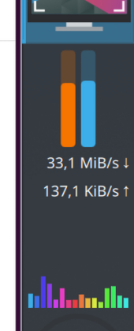
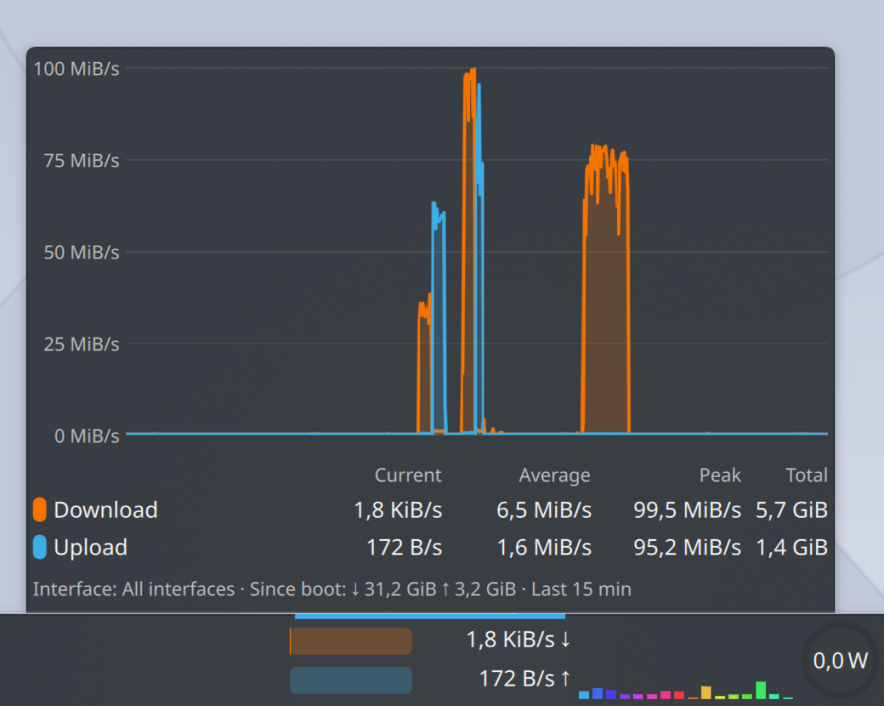
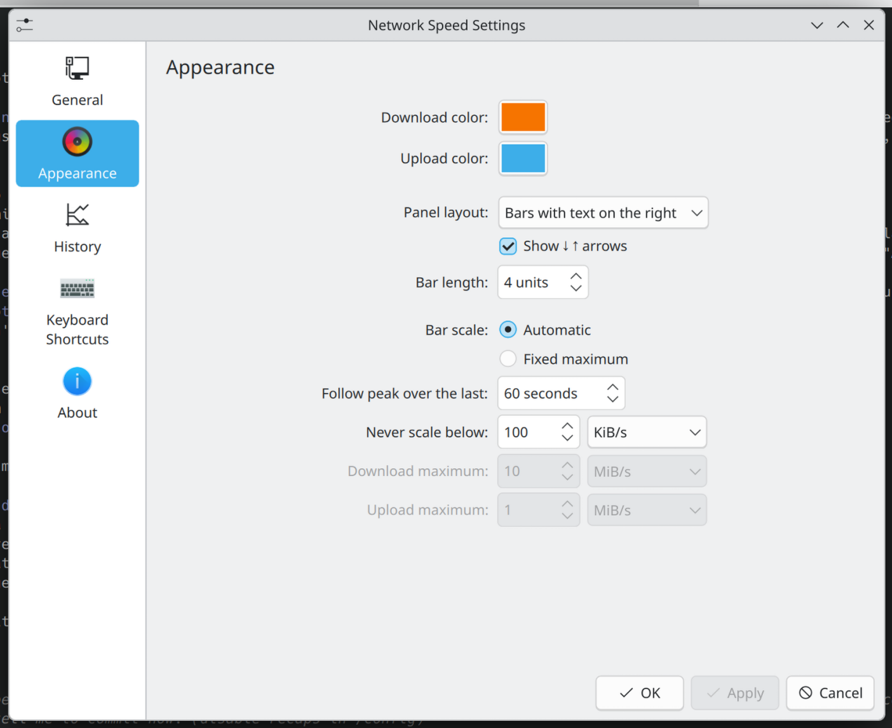

# Network Speed

A Plasma 6 widget that shows download and upload speed at a glance in the
panel, as two fill bars with text, and expands to a history chart with
statistics.

- **Panel (horizontal):** download over upload, each a bar plus a rate
  label. Text can go right or left of the bars, or you can show bars only or
  text only.
- **Panel (vertical):** two thin vertical bars with the rates underneath,
  on one line or stacked number over unit, whichever fits the panel width.
- Optional ↓ ↑ arrows after each rate (on by default), kept in one column.
- **Popup / desktop:** line chart of the last 15 minutes (configurable), with
  current, average, peak and total transferred per direction, plus totals
  since boot.
- Bytes or bits, binary or decimal prefixes, automatic or fixed unit,
  configurable decimals.
- The bar scale follows the recent peak, snapped to round 1/2/5 steps, with a
  configurable floor. A fixed maximum is also available.
- Monitors all interfaces or a single one.

## Screenshots

| Horizontal panel | Vertical panel |
|---|---|
|  |  |





## Requirements

Plasma 6 with `ksystemstats` running (it ships with Plasma System Monitor and
the standard system monitor widgets).

Data comes from `ksystemstats`, which only knows about interfaces managed by
NetworkManager. Loopback, WireGuard, Docker bridges and `veth` devices are
not listed.

## Install

From the [KDE Store](https://store.kde.org/p/2377858/): *Add Widgets → Get
New Widgets → Download New Plasma Widgets*, search for "Network Speed".

Or download the `.plasmoid` from the
[latest release](https://github.com/frapell/network-speed-widget/releases/latest)
and install it with *Add Widgets → Get New Widgets → Install Widget From Local
File…*, or `kpackagetool6 -t Plasma/Applet -i <file>`.

From source:

```sh
make install        # first time
make upgrade        # afterwards
make restart        # restart plasmashell to drop the QML cache
```

`make build` runs the tests, compiles any translations in `po/` and writes
`dist/org.frapell.networkspeed-<version>.plasmoid`. That file can be
installed with `kpackagetool6 -t Plasma/Applet -i <file>` or uploaded to the
KDE Store.

## Development

| Command | What it does |
|---|---|
| `make test` | Unit tests for the formatting and history code (needs `node`) |
| `make view` | Opens the widget in a window with `plasmawindowed` |
| `make log` | Follows plasmashell's log, filtered to QML and this widget |
| `make pot` | Regenerates the translation template in `po/` (needs `gettext`) |

The formatting and statistics code lives in `package/contents/ui/code/` as
plain JavaScript with no QML dependencies, so the tests load it directly.

## Releasing

1. Bump `KPlugin.Version` in `package/metadata.json` and commit.
2. Tag and push: `git tag v0.2.0 && git push origin v0.2.0`.
3. The [Release workflow](.github/workflows/release.yml) checks that the tag
   matches the version, runs the tests, builds the `.plasmoid` and publishes a
   GitHub release with it attached.
4. Download the `.plasmoid` from the release and upload it under *Files* on
   the [KDE Store product page](https://store.kde.org/p/2377858/), with the
   same version and a changelog entry.
   The store has no upload API, so this step is manual.

## Translations

All user-visible strings go through `i18n()`. See [`po/README.md`](po/README.md)
for how to add a language.

## License

GPL-2.0-or-later. See `LICENSE`.
